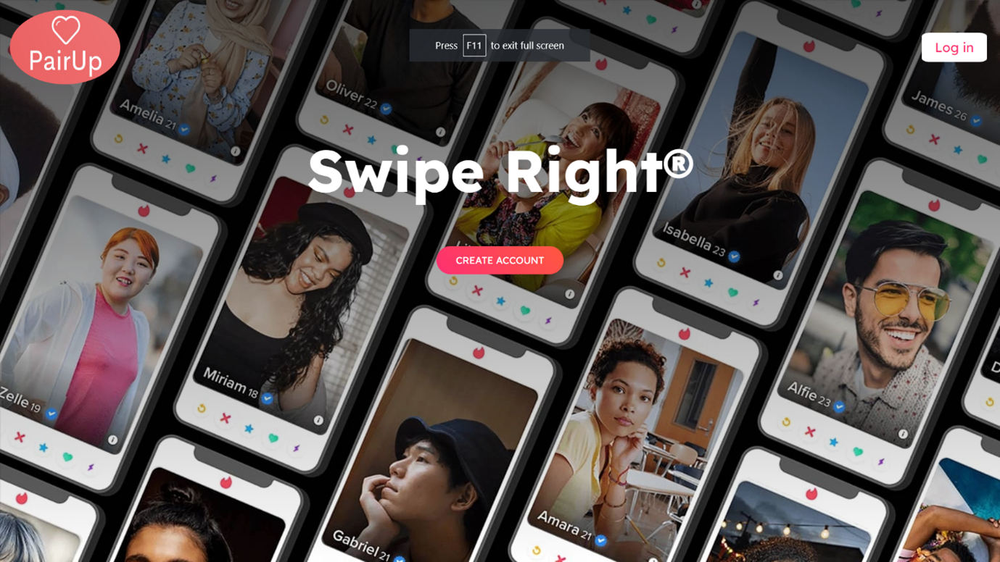

# 💘 Dating Web Application

A modern and intuitive dating web application developed using the MERN stack (MongoDB, Express.js, React.js, Node.js). This project aims to transform traditional dating experiences by offering personalized matchmaking, secure messaging, and user-friendly interactions — all on a scalable full-stack web platform.

---

## 📌 Table of Contents

- [📖 Overview](#-overview)
- [🚀 Features](#-features)
- [🛠️ Tech Stack](#-tech-stack)
- [⚙️ System Architecture](#-system-architecture)
- [📸 Screenshots](#-screenshots)
- [📊 Results](#-results)
- [🔒 Security Considerations](#-security-considerations)
- [📈 Future Enhancements](#-future-enhancements)
- [📬 Contact](#-contact)

---

## 📖 Overview

Online dating has revolutionized the way people meet and connect. This web application provides a platform for users to create profiles, match with compatible individuals, and chat securely — mimicking features similar to Tinder but adding more customization and control.

This app enables:

- Personalized user profiles
- Real-time messaging
- Matching algorithm based on preferences
- Swipe right/left mechanism
- Secure authentication

---

## 🚀 Features

- 🔐 **Authentication** using JWT (Login/Register)
- 🙍‍♂️ **User profile** creation and management
- 💘 **Swipe-based matching** system
- 💬 **Private real-time messaging**
- 📄 **Secure session management**
- 📊 **Database-backed analytics and user activity tracking**

---

## 🛠️ Tech Stack

- **Frontend**: React.js, Redux, React Router, Material-UI
- **Backend**: Node.js, Express.js
- **Database**: MongoDB (Mongoose ODM)
- **Authentication**: JWT (JSON Web Tokens)
- **Testing**: Manual Testing, Postman
- **Deployment Ready**: Built for scalability

---

## ⚙️ System Architecture

```mermaid
graph TD
A[Frontend - React.js] --> B[Backend - Express.js]
B --> C[Database - MongoDB]
B --> D[Authentication - JWT]
B --> E[Messaging System API]

## Screenshots




## 📊 Results

- Built and deployed a full-stack dating platform with a swipe-based matching mechanism  
- Integrated secure JWT authentication and stateful session handling  
- Achieved a smooth UX with profile setup, preference filters, and intuitive chat interface  
- Successfully tested major functionalities including match logic, user flow, and messaging  

---

## 🔒 Security Considerations

- JWT-based authentication for session security  
- Passwords hashed using bcrypt  
- Basic form validation and route protection  
- *(Future)* Add Two-Factor Authentication and input sanitization for XSS prevention  

---

## 📈 Future Enhancements

- 📍 Location-based matching system  
- 📹 Voice and video calling features  
- 🔎 Advanced interest-based filtering using NLP  
- 📱 Mobile App version (React Native)  
- 🧠 Enhanced AI-powered matchmaking algorithm  
